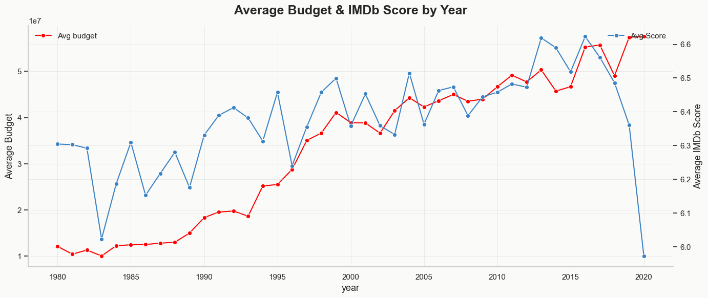
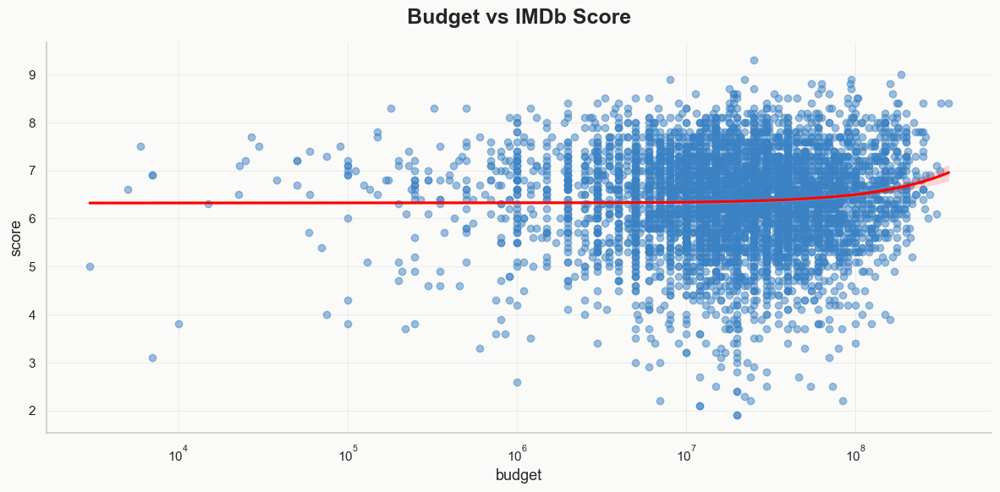
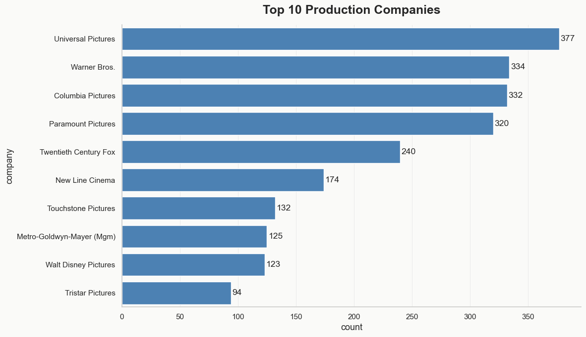
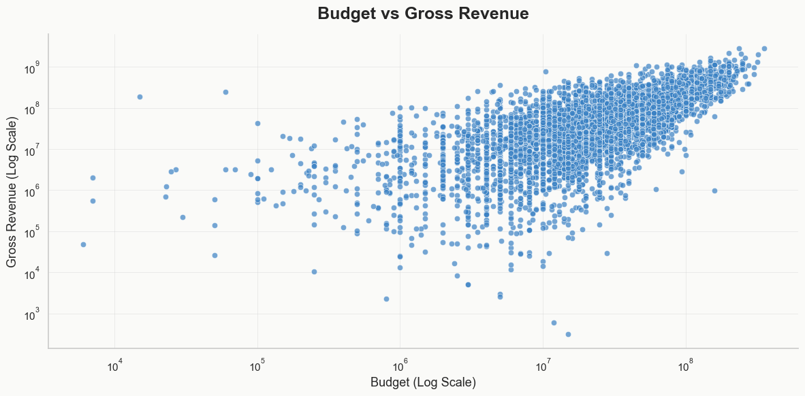

# 🎬 Does Money Buy Movie Success?

`An exploratory data analysis of 7,668 films (1980–2020), testing whether bigger budgets buy better movies — or just bigger box office numbers.`

[](https://opensource.org/licenses/MIT)
[](https://www.python.org/)
[](https://pandas.pydata.org/)
[](https://jupyter.org/)

## 📜 Project Overview

Hollywood budgets have exploded since 1980 — from a few million dollars a picture to
well over $100M for a modern tentpole. The implicit bet behind that spending is that
more money buys more success. This project tests that bet directly against 7,668 films
spanning four decades of IMDb data, separating two things that are often talked about
as if they're the same: **quality** (IMDb score) and **revenue** (box office gross).

The result: budget and revenue move together closely. Budget and quality barely move
together at all.

## ✨ Key Findings

- **Budget barely predicts quality** — the budget-vs-score relationship is close to flat.
- **Budget predicts revenue, not profit** — strong budget-gross correlation, yet 32.2%
  of films with known budget/gross still lost money.
- **Genre efficiency is wildly uneven** — Horror leads in ROI (~76x avg) and
  score-per-dollar (0.69); Animation trails in score-per-dollar (0.09).
- **Revenue is concentrated** — the top 10 studios account for 57.5% of all gross,
  led by Warner Bros. ($54.8B) and Universal ($51.2B).

## 🗺️ Table of Contents

- [📜 Project Overview](#-project-overview)
- [✨ Key Findings](#-key-findings)
- [🗺️ Table of Contents](#️-table-of-contents)
- [🚀 Getting Started](#-getting-started)
  * [Prerequisites](#prerequisites)
  * [Setup](#setup)
- [📦 The Data](#-the-data)
- [🧹 Data Cleaning](#-data-cleaning)
- [🛠️ Features Engineered](#️-features-engineered)
- [📊 Exploratory Analysis](#-exploratory-analysis)
- [📈 KPIs](#-kpis)
- [🖼️ Visuals](#️-visuals)
- [📋 Conclusion](#-conclusion)
  * [Strengths](#strengths)
  * [Limitations](#limitations)
  * [Recommendations](#recommendations)
- [📄 License](#-license)

## 🚀 Getting Started

### Prerequisites

- **Python 3.x**
- **Jupyter Notebook**
- **Required libraries:**
- 
### Setup

1. **Clone the repository:**

git clone <your-repo-url>
cd <repo-folder>


2. **Add the data:** place `IMDB (1980-2020).csv` inside a `data/` folder at the repo
   root — the notebook expects `data/IMDB (1980-2020).csv`.
3. **Run the notebook:**

```
jupyter notebook IMDB.ipynb
```

## 📦 The Data

 **Source** IMDb scrape, 1980–2020 
 **Size**  7,668 films |
 **Fields used**  budget, gross, score, votes, genre, rating, runtime, director, star, company, release date/country |

28% of films are missing budget data — mostly older or smaller releases where it was
never made public. Every budget-dependent finding below is computed only on the films
where that number actually exists (see [Limitations](#limitations)).

## 🧹 Data Cleaning

- **Country mismatches** — `country` often disagreed with the country embedded in the
  `released` field, so country was re-extracted from `released` instead.
- **Rating fragmentation** — TV ratings (TV-MA, TV-14, etc.) were mapped onto their
  closest film-rating equivalent so `rating` works as one consistent scale.
- **Missing values left as missing** — rather than imputed, so `Profit`/`ROI` naturally
  exclude rows with unknown budget instead of guessing a number.
- **Text inconsistencies** — whitespace/casing standardized in `director`, `star`,
  `company` to prevent duplicate categories.
- **Outlier sweep** — [FILL IN — e.g. "Checked budgets under \$10,000 and runtimes over
  200 minutes. Found N films with implausibly low budgets, treated as data-entry errors
  and excluded from budget-specific analysis. Long-runtime outliers checked out as real
  films and were kept."]

## 🛠️ Features Engineered

| `Profit`, `ROI` | Core financial performance measures |
| `Decade` | Groups films into 1980s / 90s / 2000s / 2010s |
| `Budget_category`, `Runtime_category` | Low/Moderate/High and Short/Moderate/Long bins |
| `Buzz_score` | Blends score and vote volume — attention, not just approval |
| `Director_avg_score`, `Star_avg_score` | Historical track record (exploration only) |
| `Market_type` | Domestic (US) vs. international release |

## 📊 Exploratory Analysis

The notebook works through EDA in layers: univariate distributions (score, budget,
runtime) → categorical breakdowns (genre, studio counts) → bivariate relationships
(budget vs. score, budget vs. gross) → trends over time (budget and score by year,
genre share of releases) → segment comparisons (score by genre). Each chart in the
notebook is followed by a short written insight.

## 📈 KPIs

| KPI | Result |
|---|---|
| Break-even rate | 67.8% profitable / 32.2% did not break even (5,436 films with known budget & gross) |
| Highest ROI genre | Horror (~76x avg, ~2x median) |
| Highest-scoring genre (min. sample) | Biography (7.03 avg, 443 films) |
| Votes-to-score correlation | r = 0.41 (raw), 0.43 (log-scaled votes) |
| Top studio by total gross | Warner Bros. ($54.8B) |
| Top 10 studios' share of total gross | 57.5% |
| Most budget-efficient genre | Horror (0.69 score per $1M) |
| Least budget-efficient genre | Animation (0.09 score per $1M) |

## 🖼️ Visuals

<p>
  
  
</p>
<p>
  
  
</p>

## 📋 Conclusion

Budget buys an audience far more reliably than it buys a good movie. Studios can spend
their way to a bigger opening; they cannot spend their way to a better IMDb score. The
most efficient genres in this dataset — Horror, Family — succeed on a fraction of the
budget that high-spend genres like Animation require for a comparable score.

### Strengths

- Clear, single guiding question carried through every section
- Financial and quality metrics kept explicitly separate rather than conflated
- KPIs computed only on films with known values, avoiding silently biased averages

### Limitations

- 28% of films are missing budget data, skewing financial KPIs toward
  better-documented (often bigger, more recent) releases
- No marketing spend captured — production budget alone understates true film cost
- No inflation adjustment across a 40-year span
- No streaming-era revenue data, which increasingly matters for recent releases

### Recommendations

- Adjust budget/gross for inflation in a future pass for cleaner cross-decade comparison
- Bring in a production-budget-vs-marketing-spend estimate if a suitable source is found
- Extend to a predictive model (e.g. random forest on `gross` or `ROI`) to quantify
  which features matter most, beyond correlation

## 📄 License

This project is licensed under the MIT License.
